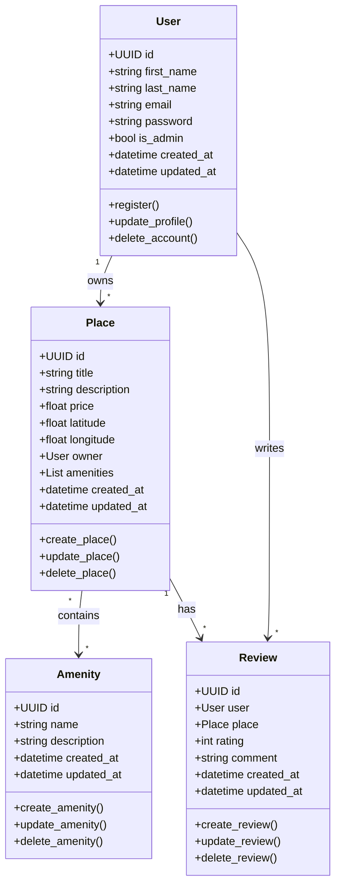

# Detailed Class Diagram for Business Logic Layer

## 📌Overview
This class diagram represents the structure and relationships of the four core entities in the business logic layer of the HBnB application.

## **Class Diagram (Mermaid.js Representation)**

## 🔍Explanatory Notes

## Entities
#### 👨 User
A user has a first name, last name, email, and password, with an optional administrator status. Users can register, update their profile, and be deleted.

#### 🏠 Place
A place has a title, description, price, latitude, and longitude, and is owned by a user. It can include multiple amenities and supports creation, update, deletion, and listing.

#### ✍️ Review
A review belongs to a specific user and place, containing a rating and comment. Reviews can be created, updated, deleted, and listed by place.

#### 🧴Amenity
An amenity has a name and description, and can be created, updated, deleted, and listed.

## Relationships
● User :left_right_arrow: Place 
One user can own multiple places, representing a one-to-many relationship.

● Place :left_right_arrow: Amenity 
A place can have multiple amenities, and each amenity can be shared by multiple places, forming a many-to-many relationship.

● User :left_right_arrow: Review 
One user can write multiple reviews, which is a one-to-many relationship.

● Place :left_right_arrow: Review 
 A place can have multiple reviews, also representing a one-to-many relationship.

## Conclusion
This class diagram provides a clear representation of the core entities and their relationships in the business logic layer of the HBnB application. It establishes a solid foundation for implementing consistent and well-structured business rules throughout the system.
